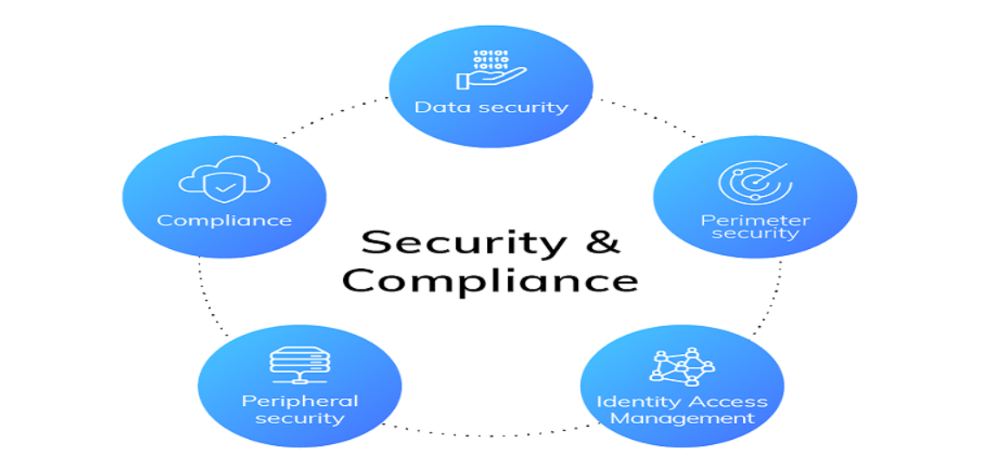
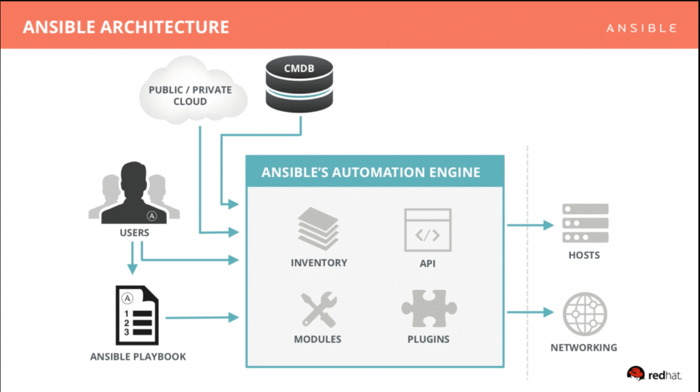

# 1. Giới thiệu
## 1.1 Ansible là gì? 
- Ansible là một trong những công cụ quản lý cấu hình hiện đại, nó tạo điều kiện thuận lợi cho công việc cài đặt, quản lý và bảo trì các server từ xa, với thiết kế tối giản giúp người dùng cài đặt và chạy nhanh chóng.Người dùng viết các tập lệnh cấp phép Ansible trong YAML, một tiêu chuẩn tuần tự hóa dữ liệu thân thiện với người dùng, chúng không bị ràng buộc với bất kỳ ngôn ngữ lập trình nào. Chính vì vậy người dùng có thể tạo ra các tập lệnh cấp phép phức tạp một cách trực quan hơn so với các công cụ còn lại trong cùng danh mục.

  

## 1.2 Ứng dụng Ansible 

- Ansible được sử dụng rất nhiều trong triển khai phần mềm và quản trị hệ thống:

  - Provisioning: Khởi tạo VM, container hàng loạt trên cloud dựa trên API - OpenStack, AWS, Google Cloud, Azure…
  - Configuration Management: Quản lý cấu hình tập trung các dịch vụ, không cần phải tốn công chỉnh sửa cấu hình trên từng server.
  - Application Deployment: Deploy ứng dụng hàng loạt, giúp quản lý hiệu quả vòng đời của ứng dụng từ giai đoạn dev cho đến production.
  - Security & Compliance: Quản lý các chính sách về an toàn thông tin một cách đồng bộ trên nhiều sản phẩm và môi trường khác nhau như deploy policy hay cấu hình firewall hàng loạt trên nhiều server,…

  

## 1.3 Kiến trúc
- Ansible sử dụng kiến trúc agentless để giao tiếp với các máy khác mà không cần agent. Cơ bản nhất là giao tiếp thông qua giao thức SSH trên Linux, WinRM trên Windows hoặc giao tiếp qua chính API của thiết bị đó cung cấp.

  

- Ansible có thể giao tiếp với rất nhiều platform, OS và loại thiết bị khác nhau. Từ Ubuntu, CentOS, VMware, Windows cho tới AWS, Azure, các thiết bị mạng Cisco và Juniper….vân vân và mây mây….(hoàn toàn không cần agent khi giao tiếp).

- Chính cách thiết kế này làm tăng tính tiện dụng của Ansible do không cần phải setup bảo trì agent trên nhiều host. Có thể coi đây là một thế mạnh của Ansible so với các công cụ có cùng chức năng như Chef, Puppet, SaltStack (Salt thì hỗ trợ cả 2 mode là agent và agentless, có thời gian thì mình sẽ viết 1 bài về Salt).

## 1.4 Một số thuật ngữ khi sử dụng Ansible 

- **Controller Machine**: Là máy cài Ansible, chịu trách nhiệm quản lý, điều khiển và gởi task tới các máy con cần quản lý.
- **Inventory**: Là file chứa thông tin các server cần quản lý. File này thường nằm tại đường dẫn /etc/ansible/hosts. Trong file gồm có các group, trong mỗi group là các node. File được định dạng INI.
- **Playbook**: Là file chứa các task của Ansible được ghi dưới định dạng YAML. Máy controller sẽ đọc các task trong Playbook và đẩy các lệnh thực thi tương ứng bằng Python xuống các máy con.
- **Task**: Một block ghi tác vụ cần thực hiện trong playbook và các thông số liên quan. Ví dụ 1 playbook có thể chứa 2 task là: yum update và yum install vim.
- **Module**: Những chức năng hỗ trợ cho việc thực thi tasks dễ và đang dạng. Ansible có rất nhiều module, ví dụ như moduel yum là module dùng để cài đặt các gói phần mềm qua yum. Ansible hiện có hơn ….2000 module để thực hiện nhiều tác vụ khác nhau, bạn cũng có thể tự viết thêm các module của mình nếu muốn.
- **Role**: Là một tập playbook được định nghĩa sẵn để thực thi 1 tác vụ nhất định (ví dụ cài đặt LAMP stack).
- **Play**: là quá trình thực thi của 1 playbook
- **Facts**: Thông tin của những máy được Ansible điều khiển, cụ thể là thông tin về OS, network, system…
- **Handlers**: Dùng để kích hoạt các thay đổi của dịch vụ như start, stop service.
- **Variables**: Được dùng để lưu trữ các giá trị và có thể thay đổi được giá trị đó. Để khai báo biến, người dùng chỉ cần sử dụng thuộc tính vars đã được Ansible cung cấp sẵn.
- **Conditions**: Ansible cho phép người dùng điều hướng lệnh chạy hay giới hạn phạm vi để thực hiện câu lệnh nào đó. Hay nói cách khác, khi thỏa mãn điều kiện thì câu lệnh mới được thực thi. Ngoài ra, Ansible còn cung cấp thuộc tính Register, một thuộc tính giúp nhận câu trả lời từ một câu lệnh. Sau đó ta có thể sử dụng chính kết quả đó để chạy những câu lệnh sau.

- **template**: Các Template được sử dụng để thiết lập các cấu hình, cho phép sử dụng các biến và các tính năng khác với mục đính làm cho các tệp trở nên linh hoạt hơn và dễ dàng sử dung lại

