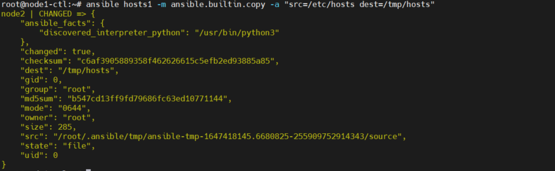
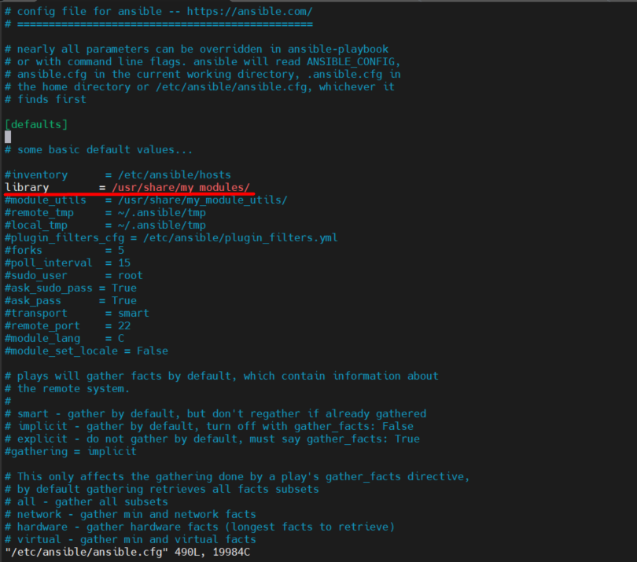

# Giới thiệu 

- Ansible ad hoc command sử dụng công cụ dòng lệnh /usr/bin/ansible để tự động hóa một tác vụ trên một hoặc nhiều nút được quản lý.
- ad hoc commands nhanh và dễ dàng, nhưng nó không thể tái sử dụng 
- Cấu trúc:
```
ansible node option []
```
# Một số ví dụ sử dụng ad hoc commands

- reboot server:

      ansible hosts1 -a "/sbin/reboot"

  - Chỉ định số lượng process chạy song song, mặc định là 5
    
        ansible hosts1 -a "/sbin/reboot" -f 10 # -f forks:

- Quản lý file         
  - Chuyển file thông qua ansible đến các server hosts1

      ansible hosts1 -m ansible.builtin.copy -a "src=/etc/hosts dest=/tmp/hosts"
  
  

  - Mô-đun ansible.builtin.file cho phép thay đổi chủ sở hữu và quyền sở hữu của file

        ansible hosts1 -m ansible.builtin.file -a "dest=/root/a.txt mode=600"
        ansible hosts1 -m ansible.builtin.file -a "dest=/root/b.txt mode=600 owner=ansible group=ansible"

- Quản lý package
  - Cài đặt một package

        ansible hosts1 -m ansible.builtin.apt -a "name=chrony state=present"

  status | mô tả
  ---|---
  absent| gỡ cài đặt package
  build-dep | đảm bảo các gói phụ thuộc được cài đặt
  latest | Chắc chắn phiên bản mới nhất được cài đặt
  present | cài đặt một package
  fixed | sửa chữa một hệ thống có phần phụ thuộc bị hỏng tại chỗ 

- Quản lý services
  - Khởi động dịch vụ trên tát cả các server 

        ansible hosts1 -m service -a "name=httpd state=started"
  
  - Khởi động lại dịch vụ trên tất cả các server

        ansible hosts1 -m service -a "name=httpd state=restarted"
    
  - Chắc chắn dịch vụ đã được dừng lại

        ansible node1 -m service -a "name=httpd state=stopped"


- Quản lý user và group

  - Có thể tạo, quản lý , xóa tài khoản của các node mà ansible server quản lý  
  - Tạo người dùng foo

        ansible node1 -m user -a "name=foo password={{ 'password' | password_hash('sha512') }}"

  - Xóa người dùng foo

        ansible node1 -m user -a "name=foo state=absent"

  - Tạo người dùng foo1 với password, shell là /bin/bash, uid 1010, thư mục chính /home/foo1

       ansible node2 -m user -a "name=foo1 password={{ 'password' | password_hash('sha512') }}   shell=/bin/bash uid=1010 home=/home/foo1"

  -  Thay đổi shell và thêm foo1 vào group root
  
       ansible node2 -m user -a "name=foo1 shell=/bin/bash  groups=root"

# Tạo module tùy biến

- Thư mục chứa Ansible Module 
  - Tại /etc/ansible/ansible.cfg cấu hình giá trị ‘library’ để chỉ định Ansible thư mục sẽ load các module tuỳ biến 
  

  - Tạo thư mục chứa module tùy biến

        mkdir -p /usr/share/my_modules/
  
  - Tạo module và nội dung module

        touch /usr/share/my_modules/user_node1

     - Nội dung 
     ``` 
     - hosts: node1
       become: True
       task:
       - name: create user foo1
          user:
          name: foo1
          password: {{ 'password' | password_hash('sha512') }}
          shell: /bin/bash
          home: /home/foo1
          groups: root
          uid: 1010
```


