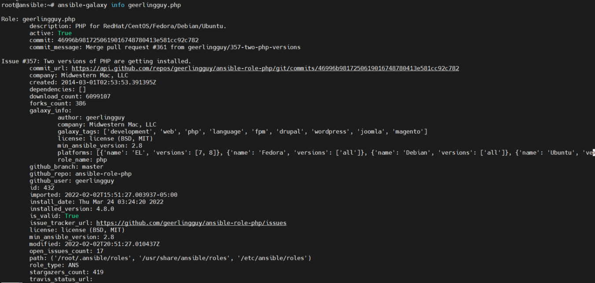
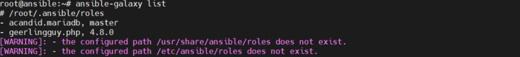

# 1. Giới thiệu
- Ansible Galaxy là một kho lưu trữ cho ansible role có thể sử dụng trực tiếp thông qua playbook nhằm hợp lý hóa các dự án tự động hóa.
- Trang web lưu trữ của Ansible Galaxy là https://galaxy.ansible.com

# 2 Hướng dẫn sử dụng ansible galaxy 
- Cấu trúc: `ansible-galaxy [-h] [--version] [-v] TYPE ..`
- 1. Tìm kiếm role bằng cách sử dụng lệnh `ansible-galaxy search`
  - Ví dụ tìm kiếm các role liên quan tới php dành có các hệ điều hành như 
RedHat/CentOS/Fedora/Debian/Ubuntu

        ansible-galaxy search "PHP for RedHat/CentOS/Fedora/Debian/Ubuntu" 
  
    Kết quả 

```
root@ansible:~# ansible-galaxy search "PHP for RedHat/CentOS/Fedora/Debian/Ubuntu"

Found 26 roles matching your search:

 Name                            Description
 ----                            -----------
 alikins.php                     PHP for RedHat/CentOS/Fedora/Debian/Ubuntu.
 apham0001.php                   PHP for RedHat/CentOS/Fedora/Debian/Ubuntu.
 bpresles.php                    PHP for RedHat/CentOS/Fedora/Debian/Ubuntu.
 call_learning.php               PHP for RedHat/CentOS/Fedora/Debian/Ubuntu.
 e1mo.php                        PHP for RedHat/CentOS/Fedora/Debian/Ubuntu.
 entanet_devops.ansible_role_php PHP for RedHat/CentOS/Fedora/Debian/Ubuntu.
 esperdyne.php                   PHP for RedHat/CentOS/Fedora/Debian/Ubuntu.
 frogasia.ansible-role-php       PHP for RedHat/CentOS/Fedora/Debian/Ubuntu.
 geerlingguy.php                 PHP for RedHat/CentOS/Fedora/Debian/Ubuntu.
 heremias.php                    PHP for RedHat/CentOS/Fedora/Debian/Ubuntu.
 jhu-sheridan-libraries.php      PHP for RedHat/CentOS/Fedora/Debian/Ubuntu.
 jibsan94.ansible_php            PHP for RedHat/CentOS/Fedora/Debian/Ubuntu.
 KAMI911.ansible_role_php        PHP for RedHat/CentOS/Fedora/Debian/Ubuntu.
 manishjuneja.php                PHP for RedHat/CentOS/Fedora/Debian/Ubuntu.
 mbaran0v.ansible_role_php       PHP for RedHat/CentOS/Fedora/Debian/Ubuntu.
 monsieurbiz.geerlingguy_php     PHP for RedHat/CentOS/Fedora/Debian/Ubuntu.
 nesh-younify.ansible-role-php   PHP for RedHat/CentOS/Fedora/Debian/Ubuntu.
 net2grid.php                    PHP for RedHat/CentOS/Fedora/Debian/Ubuntu.
 nycrecords.php                  PHP for RedHat/CentOS/Fedora/Debian/Ubuntu.
 thom8.ansible-role-php          PHP for RedHat/CentOS/Fedora/Debian/Ubuntu.
 tobiasehlert.ansible_role_php   PHP for RedHat/CentOS/Fedora/Debian/Ubuntu.
 vahubert.php                    PHP for RedHat/CentOS/Fedora/Debian/Ubuntu.
 Vaizard.mage_php                PHP for RedHat/CentOS/Fedora/Debian/Ubuntu.
 viasite-ansible.php             PHP for RedHat/CentOS/Fedora/Debian/Ubuntu.
 vvgelder.ansible-role-php       PHP for RedHat/CentOS/Fedora/Debian/Ubuntu.
 xylodev.php                     PHP for RedHat/CentOS/Fedora/Debian/Ubuntu.
```


- 2. Bên trên ta có thể thấy danh sách các role được lọc ra. Chọn một role và kiểm tra thông tin về role đó. Sử dụng lệnh `ansible-galaxy info` để xem các thông tin về role 
 
         ansible-galaxy info geerlingguy.php

  

- 3. Cần  download role về máy để sử dụng trong playbook. Sử dụng lệnh ansible-galaxy install để cài đặt role về máy

          ansible-galaxy install geerlingguy.php

Kết quả

```
root@ansible:~# ansible-galaxy install geerlingguy.php
- downloading role 'php', owned by geerlingguy
- downloading role from https://github.com/geerlingguy/ansible-role-php/archive/4.8.0.tar.gz
- extracting geerlingguy.php to /root/.ansible/roles/geerlingguy.php
- geerlingguy.php (4.8.0) was installed successfully
```
  - Liệt kê các role được cài đặt trên hệ thống

         ansible-galaxy list 

  
    
  - Role đã được cài về máy và được lưu tại /root/.ansible/roles/geerlingguy.php

- 4. Di chuyển đến vị trí đặt role. Tạo file playbook.yml để chạy role vừa cài về máy với nội dung
```
- host: node1
  roles: geerlingguy.php
```

  - Chạy role với lệnh  `ansible-playbook /root/.ansible/playbook.yml `

- 5. Sau khi sử dụng role có thể xóa role nếu không cần sử dụng 

         ansible-galaxy remove geerlingguy.php
# 2. Ansible collection

- Collection là dạng phân phối cho ansible content. Chúng được sử dụng để đóng gói và phân phối playbook, roles, modules và plugins
- Các module được người dùng tạo ra có thể đặt và sử dụng trực tiếp trong role, nhưng nó khá bất tiện. collection giúp lưu trữ các module bên ngoài ansible repo core 
- Lệnh `ansible-galaxy collection` là lệnh để sử dụng collection. Một số lệnh con đi kèm là:
  - init: Tạo một khung collection đơn giản dựa trên mẫu mặc định của ansible, hoặc mẫu riêng
  - build: Tạo một collection artifact, có thể upload lên Galaxy hoặc repo cá nhân 
  - publish: Xuất một built collection artifact lên Galaxy
  - install: Cài một hoặc nhiều collection
##  2.1 Kết cấu của một collection 
-  Asible Collections có cấu trúc tệp và thư mục tiêu chuẩn có thể chứa các modules, plugins, role và playbook
```
collection/
├── docs/
├── galaxy.yml
├── plugins/
│   ├── modules/
│   │   └── module1.py
│   ├── inventory/
│   └── .../
├── README.md
├── roles/
│   ├── role1/
│   ├── role2/
│   └── .../
├── playbooks/
└── tests/
```
- Trong đó
  - plugins/: chứa các plugins, modules, module_utils có thể tái sử dụng trong playbook và role
  - roles/: chứa các custom roles, tất cả collection playbook phải được lưu tại playbooks/
  - docs/: được sử dụng để lưu trữ tài liệu collection.
  - tests/: thư mục chứa các bài test cho collection 
  - galaxy.yml  là file text YAML chứa metadata được sử dụng trong Ansible Galaxy hub để lập collection. Nó có thể được sử dụng để liệt kê collection phụ thuộc nếu có.
# 3. Tạo một collection. 

## 3.1. Tạo khung 
  - Thư mục sẽ được lưu tại thư mục hiện tại, có thể thêm --init-path để đạt đường dẫn lưu conllection.
  -  Tên collection có dạng <namespace>.<collection>`

         ansible-galaxy collection init --init-path /root/collection redhat.workshop_demo_collection
```
collection/
└── redhat
    └── workshop_demo_collection
        ├── docs
        ├── galaxy.yml
        ├── plugins
        │   └── README.md
        ├── README.md
        └── roles

5 directories, 3 files

```

## 3.2 Thêm nội dung: custom modules và plugins

  - Trong bài lab này sẽ tạo module Hello World  và cài đặt nó trong thư mục plugins/modules

  - Tạo thư mục plugins/modules

        cd  collection/redhat/workshop_demo_collection
        mkdir plugins/modules

  - Tạo file demo_hello.py với nội dung sau 

```
#!/usr/bin/python

ANSIBLE_METADATA = {
    'metadata_version': '1.0',
    'status': ['preview'],
    'supported_by': 'community'
}

DOCUMENTATION = '''
---
module: demo_hello
short_description: A module that says hello in many languages
version_added: "2.8"
description:
  - "A module that says hello in many languages."
options:
    name:
        description:
          - Name of the person to salute. If no value is provided the default
            value will be used.
        required: false
        type: str
        default: John Doe
author:
    - Gianni Salinetti (@giannisalinetti)
'''

EXAMPLES = '''
# Pass in a custom name
- name: Say hello to Linus Torvalds
  demo_hello:
    name: "Linus Torvalds"
'''

RETURN = '''
fact:
  description: Hello string
  type: str
  sample: Hello John Doe!
'''

import random
from ansible.module_utils.basic import AnsibleModule


FACTS = [
    "Hello {name}!",
    "Bonjour {name}!",
    "Hola {name}!",
    "Ciao {name}!",
    "Hallo {name}!",
    "Hei {name}!",
]


def run_module():
    module_args = dict(
        name=dict(type='str', default='John Doe'),
    )

    module = AnsibleModule(
        argument_spec=module_args,
        supports_check_mode=True
    )

    result = dict(
        changed=False,
        fact=''
    )

    result['fact'] = random.choice(FACTS).format(
        name=module.params['name']
    )

    if module.check_mode:
        return result

    module.exit_json(**result)


def main():
    run_module()


if __name__ == '__main__':
    main()
```

## 3.3 Thêm nội dung: thêm custom role
  - Tạo một roles bên trong collection tùy chỉnh sử dụng module mới. Tạo roles hello_motd bằng cách sử dụng `ansible-galaxy init`

        ansible-galaxy init --init-path roles hello_motd

  - Thêm nội dung vào file roles/hello_motd/tasks/main.yml
```
---
# tasks file for hello_motd
- name: Generate greeting and store result
  demo_hello:
    name: "{{ friend_name }}"
  register: demo_greeting

- name: store test in /etc/motd
  copy:
    content: "{{ demo_greeting.fact }}\n"
    dest: /etc/motd
  become: yes
```

  - Mọi role có các giá trị mặc định hợp lý, thêm giá trị mặc định tại  roles/hello_motd/defaults/main.yml
  - Có thể xóa các file không sử dụng trong role
      
        rm -rf roles/hello_motd/{handlers,vars,tests}


  - Tùy chỉnh file roles/hello_motd/meta/main.yml để định nghĩa Galaxy metadata và các phụ thuộc của role.Ví dụ 

```
galaxy_info:
  author: thangdt
  description: Hello World demo
  company: your company (optional)
  license: license (GPL-2.0-or-later, MIT, etc)
  min_ansible_version: 2.9
  galaxy_tags: ["demo"]
dependencies: []
```

## 3.4 Build và install collection
  - Hiện tại ta đã có thể build collection và tạo ra một file .tar.gr có thể cài đặt và tải lên Galaxy
  - Sử dụng lệnh `ansible-galaxy collection build` để build collection
  ```
  root@ansible:~/collection/redhat/workshop_demo_collection# ansible-galaxy collection build
  Created collection for redhat.workshop_demo_collection at /root/collection/redhat/workshop_demo_collection/redhat-workshop_demo_collection-1.0.0.tar.gz
  ```
  
  - File redhat-workshop_demo_collection-1.0.0.tar.gz đã được tạo. Hiện tại đã có thể cài collection về máy.
```
root@ansible:~/collection/redhat/workshop_demo_collection# ansible-galaxy collection install redhat-workshop_demo_collection-1.0.0.tar.gz
Process install dependency map
Starting collection install process
Installing 'redhat.workshop_demo_collection:1.0.0' to '/root/.ansible/collections/ansible_collections/redhat/workshop_demo_collection'
```
  - Sau khi cài đặt file được lưu tại /root/.ansible/collections/ansible_collections/redhat/workshop_demo_collection
```
root@ansible:~# tree .ansible/collections/ansible_collections
.ansible/collections/ansible_collections
└── redhat
    └── workshop_demo_collection
        ├── docs
        ├── FILES.json
        ├── MANIFEST.json
        ├── plugins
        │   ├── modules
        │   │   └── demo_hello.py
        │   └── README.md
        ├── README.md
        └── roles
            └── hello_motd
                ├── defaults
                │   └── main.yml
                ├── files
                ├── meta
                │   └── main.yml
                ├── README.md
                ├── tasks
                │   └── main.yml
                └── templates

12 directories, 9 files
```

## 3.5 Test collection

- Tạo file playbook.yml  