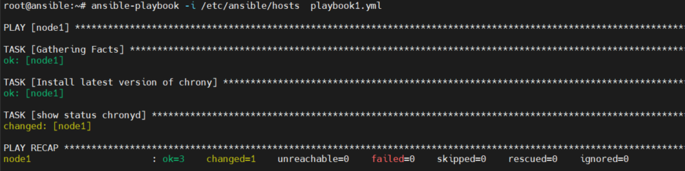

# Playbook là gì 

- Là file chứa các task của Ansible được ghi dưới định dạng YAML. Máy controller sẽ đọc các task trong Playbook và đẩy các lệnh thực thi tương ứng bằng Python xuống các máy con.

- Trong playbooks sẽ chứa một tập hợn các activities (hoạt động) hay các tasks (nhiệm vụ) sẽ được chạy trên một hay một nhóm servers. Trong đó task là một hành động duy nhất được thực hiện trên server, ví dụ như cài gói service nào đó, hay bật tắt service.

# Tạo một playbook

- Tạo một file định dạng .yml, ví dụ playbook1.yml

- Chỉnh sửa nội dung file playbook1.yml
```
- hosts: node1
  become: true
  tasks:
        - name: Install latest version of chrony
          apt: name=chrony update_cache=yes state=latest
        - name: show status chronyd
          command: systemctl status chronyd
```
- Trong đó:
  - **hosts**: chỉ định host hoặc group thực thi task
  - **become: true** nói với Ansible rằng nó sẽ sử dụng leo thang đặc quyền (sudo) để chạy tất cả các task trong playbook
  - **tasks**: Nơi các task được khai báo
  - **name** tên của task
  - **apt, command**: module được sử đụng 
# Chạy một playbook

- Sử dụng lệnh `ansible-playbook`

    ansible-playbook -i /etc/ansible/hosts  playbook1.yml

  


- Ví dụ 
  - Nội dùng file playbook1.yml
```
- hosts: node1
  become: true
  tasks:
        - name: Install latest version of chrony
          apt: name=chrony update_cache=yes state=latest
        - name: show status chronyd
          command: systemctl status chronyd
- hosts: node2
  become: true
  tasks:
          - name: update os
            command: apt update -y
          - name: install package addition
            apt: name=epel-release name=git name=byobu name=wget name=vim name=pwgen state=present
          - name: install chrony
            apt: name=chrony state=present
          - name: install java-1.8.0-openjdk-headless.x86_64
            apt: name=java-1.8.0-openjdk-headless.x86_64 state=present
```

  - Chạy file playbook.yml

    
