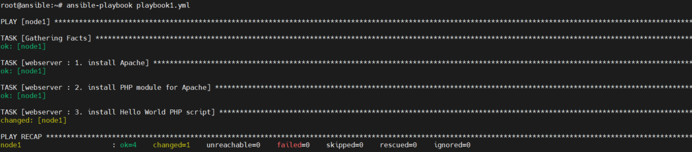

# Role là gì
- Trong Ansible, Role là một cơ chế để tách 1 playbook ra thành nhiều file. Việc này nhằm đơn giản hoá việc viết các playbook phức tạp và có thể tái sử dụng lại nhiều lần
-Role không phải là playbook. Role là một bộ khung (framework) để chia nhỏ playbook thành nhiều files khác nhau. Mỗi role là một thành phần độc lập, bao gồm nhiều variables, tasks, files, templates, và modules bên dưới.
- Việc tổ chức playbook theo role cũng giúp người dùng dễ chia sẻ và tái sử dụng lại playbook
# Thành phần 

- Một Role có 7 folder khác nhau gồm: vars, templates, handlers, files, meta, tasks, defaults và 1 file main.yml. Tasks thường là folder quan trọng nhất, thường dùng để chứa những playbook. Trong đó:
  - **tasks** – chứa danh sách các task chính được thực thi trong role này.
  - **handlers** – chứa các handler, có thể được dùng trong role này hoặc các role khác.
  - **defaults** – chứa các biến được dùng default cho role này
  - **vars** – chứa thông tin các biến dùng trong role, biến trong vars sẽ override biến trong default
  - **files** – chứa các file cần dùng để deploy trong role này, cụ thể như file binary, file cài đặt…
  - **templates** – chứa các file template theo jinja format đuôi *.j2 (có thể là file config, file systemd…).
  - **meta** – định nghĩa 1 số metadata của role này, như là dependencies

- Một role phải chứa ít nhất 1 trong 7 thư mục này để Ansible có thể hiểu được đó là 1 role. Nếu có những thư mục nào không cần dùng thì ta có thể bỏ ra


- Một cây thư mục của 1 role 
```
alertmanager
├── README.md
├── defaults
│   └── main.yml
├── files
│   ├── alertmanager.service
│   └── notifications.tmpl
├── handlers
│   └── main.yml
├── tasks
│   └── main.yml
├── templates
│   └── alertmanager.yml.j2
└── vars
    └── main.yml
```

- Để dùng 1 role thì ta có thể liệt kê role cần dùng trong 1 play, cụ thể như sau:
```
- name: Setup Monitoring Services
  hosts: prometheus_group
  become: yes
  become_user: root
 
  roles:
      - prometheus
      - alertmanager
      - pushgateway
```
- Trong ví dụ trên, ta sẽ setup 3 role lần lượt là prometheus, alertmanager và pushgateway cho host prometheus_group

- Để dùng role thì ta cần liệt kê role đó trong 1 play. Các lệnh như copy, script, template trong 1 role có thể tham chiếu tới roles/x/{files,templates,tasks}/ trong role đó mà không cần phải ghi rõ đường dẫn tuyệt đối ra

- Một role thường thì cần phải:
  - Chạy được trong check mode ansible-playbook –check targets.yml
  - Không chạy lại lần 2 nếu playbook không thay đổi (Idempotent!!)
  - Nên dùng lệnh assert trong playbook để kiểm tra các điều kiện khi chạy playbook
  - Các file config trong folder template nên dùng lệnh validate trước khi copy file
  - Chỉ nên trigger các handler khi file config thay đổi
  - Nên có sẵn nhiều biến trong defaults nhất có thể
  - Dùng một tool version control (git, svm…) để theo dõi sự thay đổi của role

# Hướng dẫn viết role 
- Các bước để viết một role 
  - 1.  Tạo folder role trước, nếu chưa có. Folder này phải có tên là roles
  - 2. Tạo 1 folder trước một role cụ thể, ví dụ như prometheus
  - 3. Tạo folder tasks để chứa playbook setup prometheus
  - 4. Tạo folder vars để chứa các biến cần dùng trong khi setup prometheus
  - 5. Tạo folder files để chứa các file cho role (file .rpm, .deb hoặc file binary…)
  - 6. Tạo folder handlers để chứa các handler cần thiết
  - 7. Và cuối cùng nhưng không kém phần quan trọng đó là….viết Readme để dễ dàng chia sẻ role này với mọi người :3


## Cài đặt LAMP với Playbooks và Roles

### Playbooks 

- Tạo một file playbook và viết vào đấy những việc cần làm sau:
  - Install Apache
  - Install PHP
  - Start Apache
  - Show "Hello World!"

  - Nội dung file
```
- hosts: node1
  tasks:
    - name: 1. install Apache
      apt: name=apache2 state=present
    - name: 2. install PHP module for Apache
      apt: name=libapache2-mod-php state=present
    - name: 3. install Hello World PHP script
      copy: src=index.php  dest=/var/www/index.php mode=0664

```

  - Chạy file 

        ansible-playbook playbook1.yml

### role 

- Tạo thư mục role và các thành phần trong role 
```
root@ansible:~# ls -R roles/webserver/
roles/webserver/:
files  tasks

roles/webserver/files:
index.php

roles/webserver/tasks:
main.yml
```

- Trước tiên là roles/webserver/tasks/main.yml sẽ chứa đoạn script mô tả tasks cần thực hiện trong việc cài đặt và chạy webserver.
```
# roles/webserver/tasks/main.yml
---
- name: 1. install Apache
  apt: name=apache2 state=present
- name: 2. install PHP module for Apache
  apt: name=libapache2-mod-php state=present
- name: 3. install Hello World PHP script
  copy: src=index.php  dest=/var/www/index.php mode=0664
```

- Trong thư mục roles/webserver/files chúng ta để file mẫu index.html vào.

- Và sau cùng là ở file playbook.yml chính ta sẽ khai báo webserver trong thuộc tính roles.
```
#playbook1.yml
---
- hosts: node1
  roles:
    - webserver
```

- Chạy lại playbook1.yml

    


### Cài đặt Database

- Những việc cần làm 
  - Install MariaDB package
  - Start MariaDB service
  - Create database
  - Create database user
  - Import database
  - Install MySQL extension for PHP
  - Copy html script to query the database


- Đầu tiên tạo role database với cấu trúc như sau
```
root@ansible:~# ls roles/database/
files  tasks
root@ansible:~# ls -R roles/database/
roles/database/:
files  tasks

roles/database/files:
db.html  dump.sql

roles/database/tasks:
main.yml
```

- Viết file main.yml trong thư mục roles/database/tasks

```
# roles/database/tasks/main.yml
---
- name: 1a. Add APT GPG signing key
  apt_key: url=http://keyserver.ubuntu.com/pks/lookup?op=get&search=0xCBCB082A1BB943DB state=present

- name: 1b. Add APT repository
  apt_repository: repo='deb http://ftp.osuosl.org/pub/mariadb/repo/10.0/ubuntu $ansible_distribution_release main' state=present update_cache=yes

- name: 1c. Install MariaDB server package
  apt: name=mariadb-server state=present

- name: 2. Start Mysql Service
  service: name=mysql state=started enabled=true

- name: Install python Mysql package #required for mysql_db tasks
  apt: name=python3-mysqldb state=present

- name: 3. Create a new database
  mysql_db: name=demo state=present collation=utf8_general_ci

- name: 4. Create a database user
  mysql_user: name=demo password=demo priv=*.*:ALL host=localhost state=present

- name: 5a. Copy sample data
  copy: src=dump.sql dest=/tmp/dump.sql

- name: 5b. Insert sample data
  shell: cat /tmp/dump.sql | mysql -u demo -pdemo demo

- name: 6. Install MySQL extension for PHP
  apt: name=php7.4-mysql state=present
```


- Sau đó là câu lệnh sql tạo table, file sql này sẽ đặt trong thư mục files
```
# roles/database/files/dump.sql
CREATE TABLE IF NOT EXISTS demo (
  message varchar(255) NOT NULL
) ENGINE=MyISAM DEFAULT CHARSET=utf8;

INSERT INTO demo (message) VALUES('Hello World!');
```

-  Cuối cùng là viết một file php kết nối với mysql và lấy dữ liệu lên.
```
# roles/database/files/db.php


$connection = new PDO('mysql:host=localhost;dbname=demo', 'demo', 'demo');
$statement  = $connection->query('SELECT message FROM demo');

echo $statement->fetchColumn();
```


### install mariadb with ansible 
- Tạo thư mục chứa roles mariadb 
-  Viết nội dung file main.yml trong role/mariadb/vars
```
mysql_root_password: "password1"
```

- Viết nội dung file main.yml trong role/mariadb/tasks
```
- name: install mariadb
      apt:
        name:
          - mariadb-server
          - python3-PyMySQL
        state: latest
    - name: start mariadb
      service:
        name: mariadb
        enabled: true
        state: started
    - name: mysql_root_password
      mysql_user:
        login_user: root
        login_password: "{{ mysql_root_password }}"
        user: root
        check_implicit_admin: true
        password: "{{ mysql_root_password }}"
        host: localhost
    - name: remove remote root
      mysql_user:
        check_implicit_admin: true
        login_user: root
        login_password: "{{ mysql_root_password }}"
        user: root
        host: "{{ ansible_fqdn }}"
        state: absent
```


- Cần phân quyền user trước khi tạo database và điều chỉnh ip đầu ra 