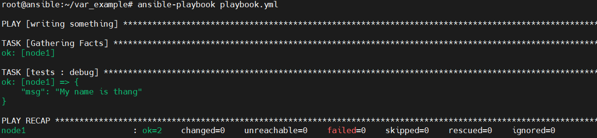

# 1. Giới thiệu 
- Trong ansible, các biến có độ ưu tiên sử dụng khác nhau, dưới đây là danh sách độ ưu tiên của biếu từ thấp đến cao 

1. command line values (for example, -u my_user, these are not variables)
2. role defaults (defined in role/defaults/main.yml)(1)
3. inventory file or script group vars(2)
4. inventory group_vars/all(3)
5. playbook group_vars/all(3)
6. inventory group_vars/*(3)
7. playbook group_vars/*(3)
8. inventory file or script host vars(2)
9. inventory host_vars/*(3)
10. playbook host_vars/*(3)
11. host facts / cached set_facts(4)
12. play vars
13. play vars_prompt
14. play vars_files
15. role vars (defined in role/vars/main.yml)
16. block vars (only for tasks in block)
17. task vars (only for the task)
18. include_vars
19. set_facts / registered vars
20. role (and include_role) params
21. include params
22. extra vars (for example, -e “user=my_user”)(always win precedence)

- Chú thích 
  - (1): Các task trong role xem chủ sở hữu mặc định của role. Các task được xác định bên ngoài của role xem là giá trị mặc định cuối cùng của role 
  - (2): Biến xác định trong file inventory hoặc cung cấp bởi inventory động 
  - (3): Bao gồm các var được thêm bởi 'vars plugins' giống như host_var và group_var được hêm vào bởi vars plugin mặc định đi kèm với ansible
  - (4): Khi được tạo đi kèm với option set_facts’s cacheable, biến có độ ưu tiên cao trong play, nhưng giống như độn ưu tiên của host fact khi chúng đề từ cache
- Nói chung, Ansible ưu tiên cho các biến được xác định gần đây hơn, tích cực hơn và có phạm vi rõ ràng hơn. Các biến trong thư mục mặc định bên trong role  dễ bị ghi đè


# 2. Ví dụ  
- Tạo một playbook.yml  với nội dung:
```
---
- name: writing something
  hosts: node1
  tasks:
    - debug:
            msg="My name is  name1 "
```
- Tạo  một file inventory với nội dung `node1 ansible_host=192.168.70.51 ansible_port=22 ansible_user=root` để chỉ định host 


## 1. command line values

- Là các option đi kèm theo dòng lệnh như   [-h], [--version], [-v], [-b], [--become-method BECOME_METHOD], [-i INVENTORY]
- Nhập lệnh `ansible-playbook -i ../../etc/ansible/hosts playbook.yml`
    

## 2. role defaults
- Là file biến mặc định của role, ansible sẽ tự động lấy biến tại đây mà không cần khai báo  
- Các biến mặc định của ansible được đặt tại  role/defaults/main.yml
    

- Tạo một role tên test bằng ansible-galaxy
  - File roles/tests/tasks/main.yml
```
- debug:
    msg="My name is {{ name1 }}"
```
  - File roles/tests/defaults/main.yml
```
name1: thang
```
  - file playbook.yml
```
---
- name: writing something
  hosts: node1
  roles:
    - tests 
```
- Kết quả 
    

## 3. inventory file or script group vars
- Là các biến được khai báo cho group trong file inventory
- Tạo file inventorys/inventory có nội dung như sau 
```
[ubuntu]
node ansible_host=192.168.70.51 ansible_port=22 ansible_user=root
[ubuntu:vars]
name1=thang
```
- Ở đây khai báo biến name1 cho group ubuntu

- Chạy file playbook.yml  
    

## 4. inventory group_vars/all
- Là biến được khai báo trong thư mục group_vars đứng cùng cấp với file inventory và các biến được tất cả các group trong file inventory sử dụng  
- Tạo thư mục  inventorys/group_vars và file inventorys/group_vars/all.yml có nội dung 

      name1: thang1
- Chạy file playbook
    


-

## 5. playbook group_vars/all
- Là biến được khai báo trong thư mục group_vars đứng cùng cấp với file playbook và các biến được sử dụng cho các group 
- Tạo file group_vars/all.yml có nội dung 

      name1: thang2

- Chạy file playbook

    

## 6. inventory group_vars/*
- Là biến được khai báo trong thư mục group_vars đứng cùng cấp với file inventory và các biến được group chỉnh định trong file inventory sử dụng 
- Tạo file inventorys/group_vars/ubuntu.yml có nội dung 
      
      name1: thang3

- Chạy file playbook 
    

## 7. playbook group_vars/*
- Là biến được khai báo trong thư mục group_vars đứng cùng cấp với file playbook và được sử dụng cho một group chỉ định  
-  Tạo file group_vars/ubuntu.yml có nội dung 

       name1: thang4

- Chạy file playbook 

    

## 8. inventory file or script host vars
- Là các biến được khai báo cho host trong file inventory
- Ta có file inventorys/inventory có nội dung như sau 
```
[ubuntu]
node ansible_host=192.168.70.51 ansible_port=22 ansible_user=root name1=thang5

[ubuntu:vars]
name1=thang1
```
- Chạy file playbook 
    


## 9. inventory host_vars/*

- Là biến được khai báo trong thư mục host_vars đứng cùng cấp với file inventory và các biến được sử dụng cho host được khai báo trong file inventory
- Tạo thư mục  inventorys/host_vars và file inventorys/host_vars/node.yml có nội dung 

      name1: thang6

- Chạy file playbook 
    

## 10. playbook host_vars/*
- Là các biến được khai báo trong thư mục host_var đứng cùng cấp với playbook và các biến được sử dụng cho host chỉ định

-  Tạo thư mục  host_vars và file host_vars/node.yml có nội dung 

      name1: thang7

- Chạy file playbook 
 


## 11. host facts / cached set_facts
- Các biến được khai báo trong tasks

## 12. play vars 
- Là các biến được khai báo trong file playbook 
- Ví dụ ta khai báo biến trong file playbook.yml 
```
---
- name: writing something
  hosts: node
  vars:
    name1: thang8
  roles:
    - tests

```

- Chạy file playbook 
 

## 13. play vars_prompt
- vars_prompt nhắc người dùng nhập một số thông tin từ màn hình  

- Ta có file playbook.yml như sau: 
```
---
- name: writing something
  hosts: node
  vars:
    name1: thang8
  vars_prompt:
          - name: "name1"
            prompt: "input name"
            private: no
  roles:
    - tests
```
- Chạy file playbook.yml và nhập thông tin

 


## 14. play vars_files

- Trong role ta có thể xác định biến trong một file  và đưa file vào trong playbook.
- Tạo file roles/tests/files/var_file.yml với nội dung: 

      name1=10

- Sửa file playbook.yml như sau: 
```
---
- name: writing something
  hosts: node
  vars:
    name1: thang8
  vars_prompt:
          - name: "name1"
            prompt: "input name"
            private: no
  vars_files:
          - roles/tests/files/var_file.yml

  roles:
    - tests

```

- Chạy file  playbook.yml

 


## 15. role vars (defined in role/vars/main.yml)

- Là biến được xác định tại thư mục  role/vars/main.yml và được role sử dụng tự động
- Chỉnh sửa thư mục roles/tests/vars/main.yml với nội dung 

      name1: thang11

- Chạy file playbook 
 

## 16. block vars (only for tasks in block)


## 17. task vars (only for the task)

## 18. include_vars
- Là biến được khai báo ở trong file và được gọi sử dụng trong task thông qua module include_vars
- Tạo file  roles/tests/files/include_file.yml chứa nội dung 

      name1: thang13

- Chỉnh sử file roles/tests/tasks/main.yml như sau 
```
- include_vars:
      roles/tests/files/include_file.yml
- debug:
      msg: "My name is {{ name1 }}"

```
- Chạy file playbook 
 


## 19. set_facts / registered vars
- Là biến được khai báo thông qua module set_fact trong file task của role 
- Chỉnh sử file roles/tests/tasks/main.yml như sau 
```
---
# tasks file for roles/tests
- set_fact:
      name1: thang14
- include_vars:
      roles/tests/files/include_file.yml
- debug:
      msg: "My name is {{ name1 }}"
```
- Chạy file playbook 

 

## 20. role (and include_role) params

## 21. include params

## 22. extra vars (for example, -e “user=my_user”)(always win precedence)
- Là biến được nhập trực tiếp từ dòng lệnh thông qua tham số -e (--extra-vars) và có độ ưu tiên cao nhất.
- Nhập lệnh

      ansible-playbook  -i inventorys/inventory playbook.yml  -e name1=thang17

 
