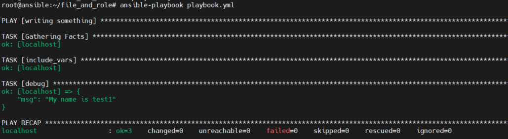

# 1. Giối thiệu  
- Trong ansible, các biến đóng vai trò rất quan trọng, đây là những điểm tham chiếu mà playbook sẽ tham chiếu đến để lấy dữ liệu. Biến có thể được định nghĩa ở nhiều nơi và bằng nhiều cách. 
- Biến hoạt động trong ansible giống như một số ngôn ngữ lập trình khác.
- Các biến có đặc điểm giống như tên hợp lệ, xác định biến, gọi biến, biến đặc biệt ansible, mảng biến và nhập từ các file khác

# 2. Biến trong ansible 

- Tên hợp lệ của một biến thỏa mãn
  - Tên biến phải bắt đầu bằng chữ cái
  - Tên biến phải chứa các ký tự, số hoặc dấu gạch dưới
  - Tên biến hợp lệ như: foo, foo_ss, foo4,...
  - Tên biến không hợp lệ: 4foo, foo 4, foo.ww,...

## 2.1 Biến trong file inventory

- Có thể thêm biến trong file invertory, nó có thể giới hạn phạm vi đến một host, group hay tất cả các host trong file. Nó có thể giống như: 

```
[hosts1]
node1 ansible_host=192.168.70.51 ansible_port=22 ansible_user=root
[hosts2]
node2 ansible_host=192.168.70.52 ansible_port=22 ansible_user=root
```

## 2.2 Biến trong Playbook
- Biến được đặt trong phần vars của playbook với tên và giá trị của biên 
- Ví dụ  
```
---
 - hosts: server2
   vars:
     port_no: 80
     pkg_name: httpd

   gather_facts: no
   tasks:
   - debug:
       msg:
        - "The value of port is {{ port_no }}"
        - "The value of pkg is {{ pkg_name }}"
        - "The value of hostname is {{ inventory_hostname }}"
        - "Ansible version is {{ ansible_version }}"      
```

  - Trong ví dụ trên có 2 biến được khai báo là  `port_no: 80` và `pkg_name: httpd`. Ngoài 2 biến được khai báo còn có các biến tích hợp sẵn `inventory_hostname` và  `ansible_version`


## 2.3 File và role 
- Trong role ta có thể xác định biến trong một file  và đứa file vào trong playbook 
- Ví dụ
  - Tạo file var_name.yml với nội dung sau:
```
name1: ansible
```
  - Tạo file playbook.yml và sử dụng biến name1.

```

- name: writing something
  hosts: localhost
  tasks:
    - include_vars: var_name.yml
    - debug: msg="My name is {{ name1 }}"

```

  - Chạy playbook 
  

2.4 Biến thông qua dòng lệnh  

