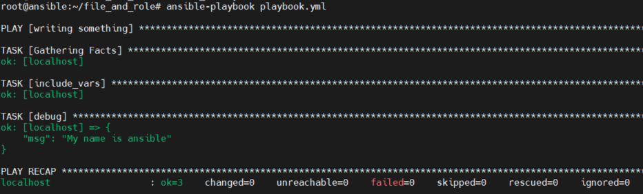

# 1. Giới thiệu  
- Trong ansible, các biến đóng vai trò rất quan trọng, đây là những điểm tham chiếu mà playbook sẽ tham chiếu đến để lấy dữ liệu. Biến có thể được định nghĩa ở nhiều nơi và bằng nhiều cách. 
- Biến hoạt động trong ansible giống như một số ngôn ngữ lập trình khác.
- Các biến có đặc điểm giống như tên hợp lệ, xác định biến, gọi biến, biến đặc biệt ansible, mảng biến và nhập từ các file khác

# 2. Biến trong ansible 

- Tên hợp lệ của một biến thỏa mãn
  - Tên biến phải bắt đầu bằng chữ cái
  - Tên biến phải chứa các ký tự, số hoặc dấu gạch dưới
  - Tên biến hợp lệ như: foo, foo_ss, foo4,...
  - Tên biến không hợp lệ: 4foo, foo 4, foo.ww,...

## 2.1 Biến trong file inventory

- Có thể thêm biến trong file inventory, nó có thể giới hạn phạm vi đến một host, group hay tất cả các host trong file. Nó có thể giống như: 

```
[hosts1]
node1 ansible_host=192.168.70.51 ansible_port=22 ansible_user=root
[hosts2]
node2 ansible_host=192.168.70.52 ansible_port=22 ansible_user=root
```

## 2.2 Biến trong Playbook
- Biến được đặt trong phần vars của playbook với tên và giá trị của biên 
- Ví dụ  
```
---
 - hosts: server2
   vars:
     port_no: 80
     pkg_name: httpd

   gather_facts: no
   tasks:
   - debug:
       msg:
        - "The value of port is {{ port_no }}"
        - "The value of pkg is {{ pkg_name }}"
        - "The value of hostname is {{ inventory_hostname }}"
        - "Ansible version is {{ ansible_version }}"      
```

  - Trong ví dụ trên có 2 biến được khai báo là  `port_no: 80` và `pkg_name: httpd`. Ngoài 2 biến được khai báo còn có các biến tích hợp sẵn `inventory_hostname` và  `ansible_version`


## 2.3 Biến trong file và role 
- Trong role ta có thể xác định biến trong một file  và đứa file vào trong playbook 
- Ví dụ
  - Tạo file var_name.yml với nội dung sau:
```
name1: ansible
```
  - Tạo file playbook.yml và sử dụng biến name1.

```

- name: writing something
  hosts: localhost
  tasks:
    - include_vars: var_name.yml
    - debug: msg="My name is {{ name1 }}"

```

  - Chạy playbook 
  

## 2.4 Biến thông qua dòng lệnh  

- Sử dụng biến thông qua dòng lệnh bằng cách sử dụng tham số — extra-vars hoặc -e.
- Tiếp tục từ ví dụ phần 2.3. File playbook.yml có nội dung như sau: 
```
---
- name: writing something
  hosts: localhost
  tasks:
    - include_vars: var_name.yml
    - debug:
            msg="My name is {{ name1 }}.Your name is {{ name2 }}"
```
  - Nhập lệnh `ansible-playbook playbook.yml -e "name2=thang"`. Kết quả: 

  

  - Nhập lênh `ansible-playbook playbook.yml -e "name1=thangdt name2=thang"`. Kết quả:

  
  
  - Ta thấy biến được nhập từ dòng lệnh đã ghi đè lên biến được khai báo trong file var_name.yml. 

## 2.5 Host and Group variables

- Mặc dù có thể chỉ định biến trong file inventory, nhưng trong thực hành không khuyến khích lưu trữ các biến trong file inventory.
- Trong một file biến host, biến chỉ đến một host trong file inventory. File biến host thường được lưu trữ trong thư mục /etc/ansible/host_vars.
- File inventory dưới đây có 2 máy chủ sử dụng  2 server ntp khác nhau
```
[web_servers]
webserver_1  ntp_server=uk.pool.ntp.org
webserver_2  ntp_server=de.pool.ntp.org
```

- Thay vì chỉ định chúng trong file inventory, tạo 2 file host var trong thư mục host_vars với tên phù hợp với chức năng của chúng  
```
# vi /etc/ansible/host_vars/webserver_1
---
ntp_server=uk.pool.ntp.org

# vi /etc/ansible/host_vars/webserver_2
---
ntp_server=de.pool.ntp.org
```
- Nếu các host chia sẻ các giá trị giống nhau, hãy tạo một file group var trong thư mục /etc/ansible/group_vars. Tên tệp biến nhóm phải khớp với nhóm máy chủ

  - Quan sát file inventory dưới đây

```
[web_servers]
webserver_1
webserver_2
[web_servers:vars]
ansible_user=root
ansible_port=22
```
  - Có 2 phần được định nghĩa trong file inventery. Nó phải nằm trong thư mục /etc/ansible. Tên của file phải giống tên của tên của group.
```
# vi /etc/ansible/group_vars/web_servers
---
ansible_user=root
ansible_port=22
```
  - Tại đây, các biến sẽ có thể truy cập được đối với tất cả các máy chủ của nhóm được gọi là máy chủ web.

## 2.6 Biến đặc biệt trong Ansible Playbook 
- Các biết đặc biệt chứa nội dung  có sẵn mà người dùng không thể đặt và Ansible sẽ luôn ghi đè. 
- Một số biết đặc biệt 
  - ansible_all_ipv4_addresses
  - ansible_architecture
  - ansible_bios_version
  - ansible_os_family
  - ansible_distributio
- Dùng lệnh `ansible -m setup hostname ` để xem danh sách các biến hệ thống
  
 
# 3. Độ ưu tiên của biến trong ansible

- Trong ansible, các biến có độ ưu tiên sử dụng khác nhau, dưới đây là danh sách độ ưu tiên của biếu từ thấp đến cao 

1. command line values (for example, -u my_user, these are not variables)
2. role defaults (defined in role/defaults/main.yml)(1)
3. inventory file or script group vars(2)
4. inventory group_vars/all(3)
5. playbook group_vars/all(3)
6. inventory group_vars/*(3)
7. playbook group_vars/*(3)
8. inventory file or script host vars(2)
9. inventory host_vars/*(3)
10. playbook host_vars/*(3)
11. host facts / cached set_facts(4)
12. play vars
13. play vars_prompt
14. play vars_files
15. role vars (defined in role/vars/main.yml)
16. block vars (only for tasks in block)
17. task vars (only for the task)
18. include_vars
19. set_facts / registered vars
20. role (and include_role) params
21. include params
22. extra vars (for example, -e “user=my_user”)(always win precedence)

- Chú thích 
  - (1): Các task trong role xem chủ sở hữu mặc định của role. Các task được xác định bên ngoài của role xem là giá trị mặc định cuối cùng của role 
  - (2): Biến xác định trong file inventory hoặc cung cấp bởi inventory động 
  - (3): Bao gồm các var được thêm bởi 'vars plugins' giống như host_var và group_var được hêm vào bởi vars plugin mặc định đi kèm với ansible
  - (4): Khi được tạo đi kèm với option set_facts’s cacheable, biến có độ ưu tiên cao trong play, nhưng giống như độn ưu tiên của host fact khi chúng đề từ cache
- Nói chung, Ansible ưu tiên cho các biến được xác định gần đây hơn, tích cực hơn và có phạm vi rõ ràng hơn. Các biến trong thư mục mặc định bên trong role  dễ bị ghi đè

# Tham khảo 

https://docs.ansible.com/ansible/latest/user_guide/playbooks_variables.html#id15

https://www.linuxtechi.com/use-variables-in-ansible-playbook/

https://www.educba.com/ansible-variables/

